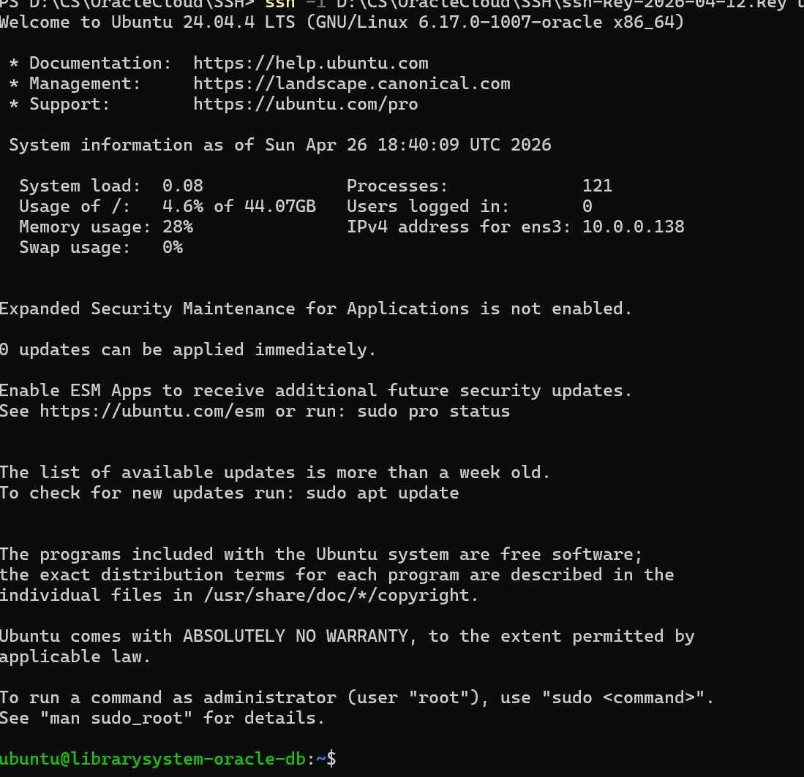

## OCI VM SSH 접속 불가 해결 가이드

<br>

> ※ ssh port 22 접속 불가 문제 발생

### 상황

Oracle Cloud Infrastructure(OCI)에서 VM을 생성 후 SSH 접속을 시도했는데 아래처럼 무한 timeout이 발생

```
ssh: connect to host 140.245.70.194 port 22: Connection timed out
```

Ping 및 SSH(TCP 22) 연결이 모두 실패하는 상황. SSH 문제가 아니라 네트워크 레벨 문제였다!

<br>

### 원인 1: Route Table에 Internet Gateway 룰이 없음

OCI VM이 인터넷과 통신하는 구조

```
VM → Subnet → Route Table → Internet Gateway → Internet
```


이 흐름, 길이 있어야 하는데 → Route Table 규칙이 0개
→ 인터넷으로 나가는 길이 없음

|구성요소|역할|위치|
|---|---|---|
|Route Table + IGW|인터넷까지 **길** 연결|Subnet 레벨|
|Security List|**패킷 허용/차단**|Subnet 진입 직전|
|VM 내부 방화벽 (iptables)|**OS 레벨** 허용/차단|VM 안|
- Security List를 수정하고 있었음.
- Route Table의 IGW가 아니라


#### 확인 방법

1. OCI 콘솔 상단 메뉴 → **Networking** 클릭
2. 왼쪽 사이드바에서 **Virtual Cloud Networks** 클릭
3. 해당 VCN 이름 클릭
4. 왼쪽 사이드바 Resources 목록에서 **Subnets** 클릭
5. 사용 중인 서브넷 이름 클릭 (예: `subnet-public`)
6. 상세 페이지 중간에 **Route Table** 항목 확인 → 연결된 Route Table 이름 클릭
7. Route Table 상세 페이지에서 **Route Rules** 확인

▷ 여기서 Rules가 **0개**였던 게 문제. 인터넷으로 나가는 경로 자체가 없었던 것.


```
내 PC
  ↓
Internet
  ↓
Internet Gateway     ← 여기서 막힘 (Route Rule 없어서 길 자체가 없었음)
  ↓
Security List        ← 22번 허용 설정되어 있었지만 여기까지 도달 못함
  ↓
VM
```
<br>

#### 해결 방법 : VCN과 연결된 Route Table에 IGW 룰 추가

<br>

---
<br>

### 원인 2: Default Route Table에 IGW 룰 추가가 안 됨 (API Error)

<br>

#### 왜 안 됐나

OCI 신규 방식에서는 **Internet Gateway에 Route Table을 직접 연결**할 수 있는데, 이렇게 연결된 Route Table은 **Private IP 룰만 허용**하는 락이 걸린다.

즉, IGW가 이미 Default Route Table을 물고 있어서, 그 테이블에 IGW 룰을 추가하려 하면 아래 에러가 난다.

```
Rules in the route table must use private IP as a target. 
Or the route table can be empty (no rules).
```
<br>

#### 해결 방법: 새 Route Table 만들어서 서브넷에 연결

**① 새 Route Table 생성**

1. OCI 콘솔 → **Networking → Virtual Cloud Networks** → 해당 VCN 클릭
2. 왼쪽 사이드바 Resources → **Route Tables** 클릭
3. 오른쪽 상단 **Create Route Table** 버튼 클릭
4. 아래처럼 설정:
    - Name: `public-route-table` (원하는 이름)
    - Route Rules에서 **+ Another Route Rule** 클릭
        - Target Type: **Internet Gateway**
        - Destination CIDR Block: `0.0.0.0/0`
        - Target Internet Gateway: 기존에 만들어둔 IGW 선택
5. **Create** 클릭

**② 서브넷에 새 Route Table 연결**

1. 왼쪽 사이드바 Resources → **Subnets** 클릭
2. 해당 서브넷 이름 클릭
3. 오른쪽 상단 **Edit** 버튼 클릭
4. **Route Table** 드롭다운에서 방금 만든 `public-route-table` 선택
5. **Save Changes** 클릭

<br>

---

<br>

### 원인 3: Security List Ingress Rules 확인

Route Table 고치기 전에 Security List도 확인해야 한다.

1. VCN → 왼쪽 사이드바 → **Security Lists** 클릭
2. Default Security List 클릭
3. **Ingress Rules** 탭에서 아래 룰이 있는지 확인:

|Stateless|Source|Protocol|Destination Port|
|---|---|---|---|
|No|0.0.0.0/0|TCP|22|
|No|0.0.0.0/0|ICMP|-|

없으면 **Add Ingress Rules** 버튼 눌러서 추가.

▷ 이 케이스에서는 이미 정상적으로 설정되어 있었다.

<br>

---

<br>

### SSH 접속 시도 → Permission denied

Route Table 문제를 해결하고 나서 SSH 접속을 시도하자 이번엔 다른 에러가 났다.

```
opc@[public IP]: Permission denied (publickey).
```

키 파일을 명시적으로 지정하지 않아서 발생한 문제.

<br>

#### 해결: 키 파일 직접 지정

powershell

```powershell
ssh -i [ssh key 파일 위치 + 파일명].key ubuntu@[public IP]
```

<br>

---


<br>

### SSH 키 파일 권한 문제 (Windows)

키 파일을 지정했더니 이번엔 또 다른 에러:

```
WARNING: UNPROTECTED PRIVATE KEY FILE!
Permissions for '[ssh key]' are too open.
Bad permissions. Try removing permissions for user: BUILTIN\Users
```

Windows에서 SSH 키 파일은 **본인만 읽을 수 있어야** 한다. `BUILTIN\Users` 그룹이 접근 가능한 상태면 SSH가 보안상 거부한다.

<br>

#### 해결: icacls로 권한 제한

PowerShell에서 아래 명령어 실행:

```powershell
icacls "[ssh key 파일 위치 + 파일명].key" /inheritance:r /grant:r "$($env:USERNAME):(R)"
```

그 다음 다시 접속 시도:

powershell

```powershell
ssh -i [ssh key 파일 위치 + 파일명].key ubuntu@[public IP]
```

<br>

---

<br>

### 최종 접속 성공

```
ubuntu@librarysystem-oracle-db:~$
```

<br>

---

<br>

### 전체 문제 원인 요약

|순서|문제|해결|
|---|---|---|
|1|Route Table Rules 0개 → 인터넷 경로 없음|새 Route Table 생성 + IGW 룰 추가|
|2|Default Route Table에 IGW 룰 추가 불가 (API Error)|서브넷에 새 Route Table 교체 연결|
|3|SSH 키 파일 미지정|`-i` 옵션으로 키 파일 직접 지정|
|4|Windows 키 파일 권한 너무 열려있음|`icacls`로 본인 전용 권한으로 제한|

<br>

#### 해결 순서

```
Ping timeout
    ↓
Security List 확인 → 정상
    ↓
Public IP 확인 → 정상
    ↓
Route Table Rules = 0 발견
    ↓
Default Route Table에 IGW 룰 추가 시도 → API Error
    ↓
새 Route Table 생성 + IGW 룰 추가 → 서브넷 교체
    ↓
SSH 접속 시도 → Permission denied
    ↓
키 파일 권한 문제 → icacls로 해결
    ↓
✅ 접속 성공
```

<br>

### 결론 : VM 접속 성공!


<br>